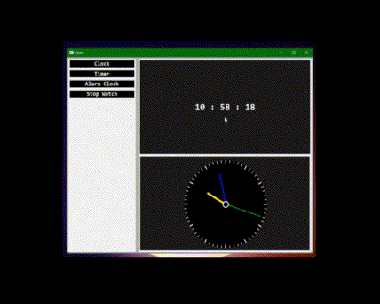
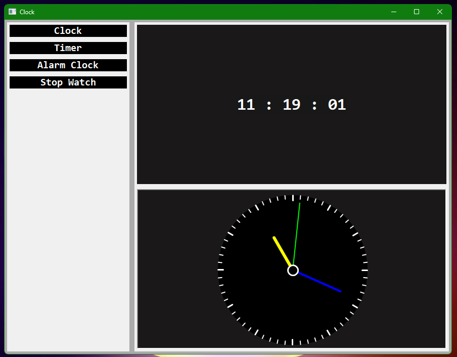
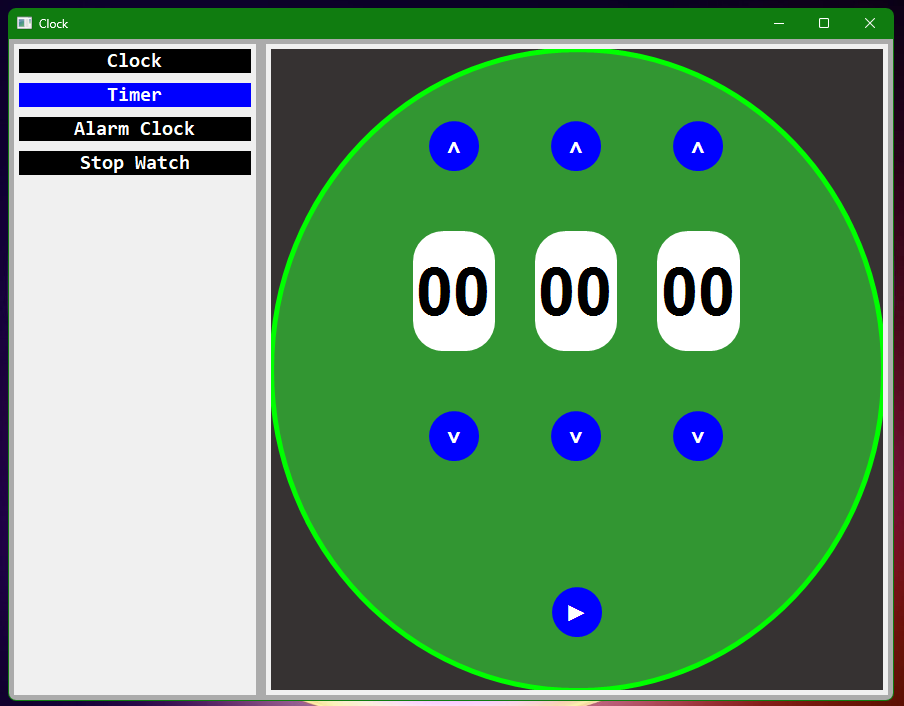
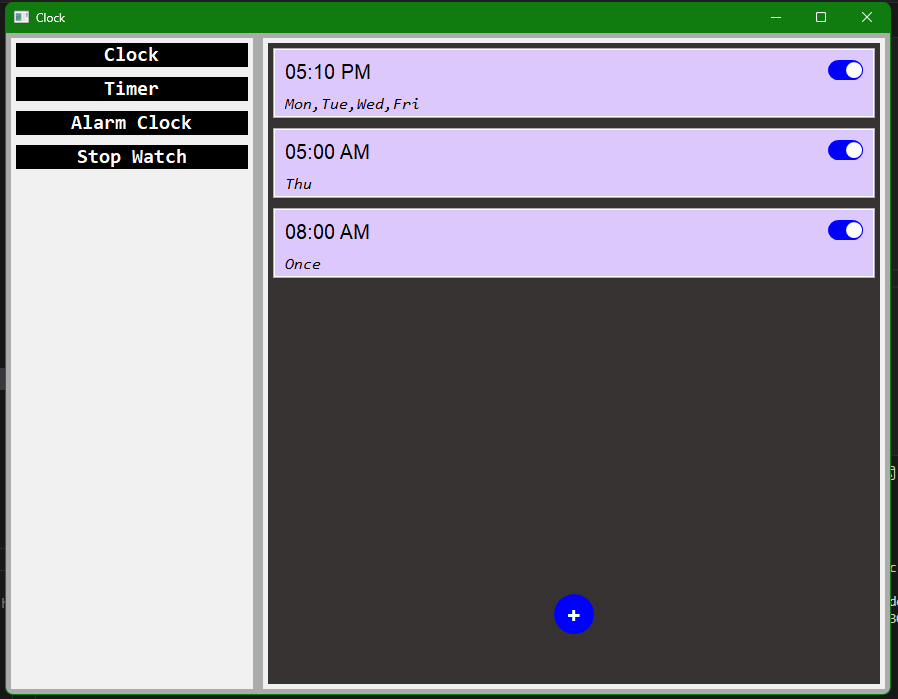
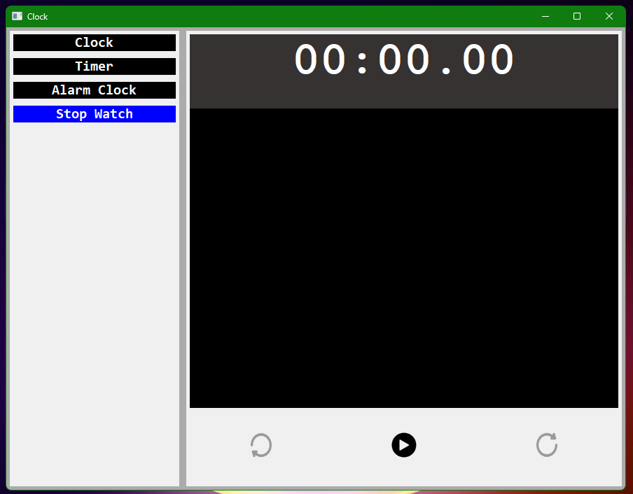
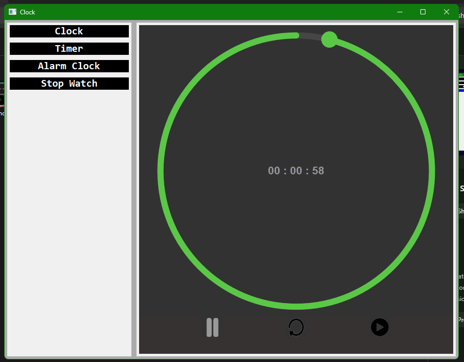
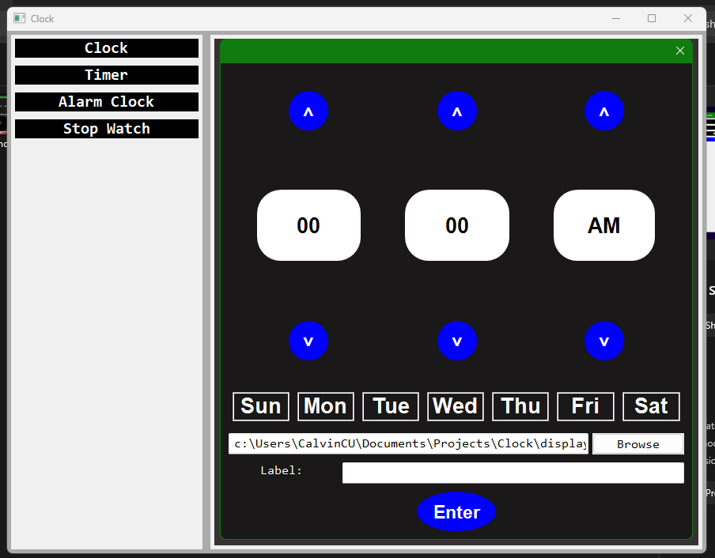

# 🕐 Clock App
> A feature-rich desktop clock application built with Python and wxPython.



## 🛠️ Built With
- **wxPython** — GUI framework
- **pygame** — alarm sound
- **datetime** — time and date handling
- **pathlib / os** — file path handling

## ✨ Features
- 🕐 Digital and analog clock
- ⏱️ Stopwatch
- ⏲️ Timer with sound
- 🔔 Alarm with sound
- 🎨 Custom widgets built from scratch
- 🗂️ Navbar to switch between tabs

## 🚀 Installation
```bash
pip install wxpython pygame
python main.py
```

## 📸 Screenshots





## 📷 Some other screenshots


